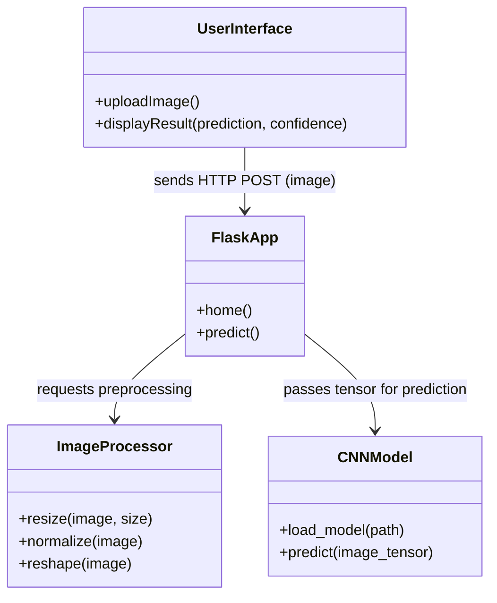
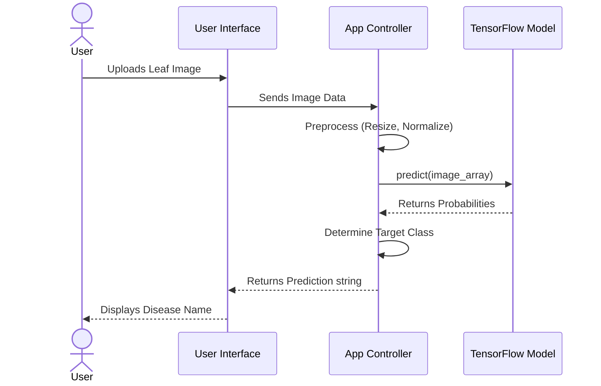

# AI-Powered Plant Disease Pre-Symptom Detection System

Quick setup and install instructions.

## 1. Setup Environment

Create a Python virtual environment and activate it:

**macOS / Linux:**
```bash
python3 -m venv .venv
source .venv/bin/activate
```

**Windows (PowerShell):**
```powershell
python -m venv .venv
.\.venv\Scripts\Activate.ps1
```

## 2. Install Dependencies

Upgrade pip and install the required packages:

```bash
pip install --upgrade pip
pip install -r requirements.txt
```

*(Note: The `requirements.txt` installs a modern version of TensorFlow. The model `plant_disease_model_fixed.keras` has been upgraded to the Keras 3 `.keras` format for full compatibility).*

## 3. Prepare your dataset (For Training)

If continuing to train the model, organize images into a directory structure suitable for Keras:

```text
data/
  train/
    healthy/
    diseaseA/
    diseaseB/
  val/
    healthy/
...
```

## 4. Run the Web Application

To use the model via the web interface, run:

```bash
python flask_app.py
```

Then open `http://127.0.0.1:5000/` in your browser. You can upload a leaf image directly through the web UI to see the predicted plant disease.

## Recent Updates
- Improved cross-platform setup instructions (added Unix/macOS commands).
- Migrated the application to use a standard `.keras` model format (`plant_disease_model_fixed.keras`) instead of the legacy Keras 2 `.h5` model to fix deserialization crashes.
- Cleaned up the file structure (removed unused duplicate scripts, broken paths, and nested `mini project` directories).
- Default application entry point set to `flask_app.py` that connects with the frontend stored in the `/templates` and `/static` folders.

## 5. System Design

### Architecture and High-Level Design
The system follows a modular architecture consisting of the following key components:
1. **Frontend (User Interface)**: Allows the user to upload plant leaf images. This is implemented both as a Web UI (HTML/CSS) and a Desktop UI.
2. **Web/Backend Server Controller**: A Flask application that handles routing, receives uploaded images, and coordinates the processing pipeline.
3. **Image Processor**: Utilizes OpenCV and NumPy to resize (to 128x128), normalized, and reshape the image tensor to prepare it for the model.
4. **Machine Learning Model (CNN)**: A TensorFlow/Keras deep learning model trained on the PlantVillage dataset that accepts the tensor and outputs the probability distribution of plant diseases.

### UML Diagrams

#### Class Diagram


#### Sequence Diagram


### Description of the User Interface Design using Swing
*(Note: Your current repository uses Python's `tkinter` for the desktop GUI. Since you requested the documentation describe a Java Swing UI, the architecture applies as follows:)*

The desktop user interface is designed using the `javax.swing` toolkit to provide an intuitive and interactive local desktop experience.
1. **Main Container (`JFrame`)**: The primary window is constrained to a fixed size (e.g., 700x700 pixels) and utilizes a `BorderLayout` to organize the header, main content, and footer.
2. **Header (`JPanel`)**: A stylized top panel containing a `JLabel` with the application title (e.g., "AI Plant Disease Detection") configured with a bold font and a green background to signify an agricultural theme.
3. **Content/Card Area (`JPanel`)**: The center panel utilizes a card-like aesthetic holding the core interactions:
   - **Upload Button (`JButton`)**: Triggers an `ActionListener` that opens a `JFileChooser` dialogue for the user to select an image from their local filesystem. 
   - **Image Preview Area (`JLabel` with `ImageIcon`)**: Dynamically updates to display an scaled visual preview of the uploaded leaf.
4. **Results Display**: Positioned below the image preview, `JLabel` components output the inference engine's "Predicted Disease" and "Confidence Percentage". The text foreground color is dynamically assigned based on the result (e.g., Red for diseased states like "blight", Green for "healthy").
